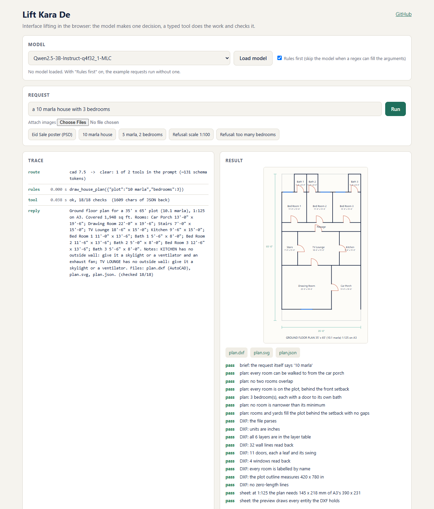

# Lift Kara De

Interface lifting in the browser. An on-device model (WebLLM on WebGPU) makes one decision per task, and a typed tool does
the work through a file format, then checks its own output and returns a few hundred characters of JSON.

**Live demo:** https://vishalmysore.github.io/liftKaraDe/

Inspired by Fareed Khan's article
[Building Fast Computer Agents to Solve Complex Tasks](https://medium.com/@fareedkhandev/cf2bda5c54e7) and his
[ai-pc](https://github.com/FareedKhan-dev/ai-pc) code. His agent drives real Windows programs; this is a small
browser-only study of the same idea. The write-up is in [docs/article.md](docs/article.md).



## What is in it

| Piece | File | What it does |
|---|---|---|
| Tool registry | `src/toolkit/registry.ts` | A tool is a schema, an implementation, an effect and an optional rules lane |
| Result shape | `src/toolkit/result.ts` | `ok`, a summary, files and the checks the tool ran on its own output |
| Shortlist | `src/toolkit/router.ts` | Regex signals pick which tool groups go into the prompt |
| Agent loop | `src/toolkit/loop.ts` | Rules or the model fill the arguments; the reply is templated from the checked result |
| Ledger | `src/toolkit/ledger.ts` | Model calls, tool calls, input tokens, seconds and checks per task |
| Model | `src/llm/engine.ts` | WebLLM in a worker, with the reply constrained to the tool's JSON schema |
| PSD tool | `src/apps/psd.ts`, `photoshop.ts` | Writes a layered PSD byte by byte, reads it back with ag-psd |
| House plan tool | `src/cad/` | Layout search, DXF in inches, SVG preview, read back with dxf-parser |

## Run it

```bash
npm install
npm run dev
```

The example requests run without a model while "Rules first" is ticked. To see the model fill the arguments, load one
(WebGPU needed) and untick it. A request can be linked: `?q=a 10 marla house with 3 bedrooms`.

## Limits

- The outputs are checked by independent parsers (ag-psd, dxf-parser), not by Photoshop or AutoCAD.
- The plan search is a simple band layout, not an architect.
- Only two tools so far. Chains, an approval gate, a DOM agent and learned skills are not built yet.
