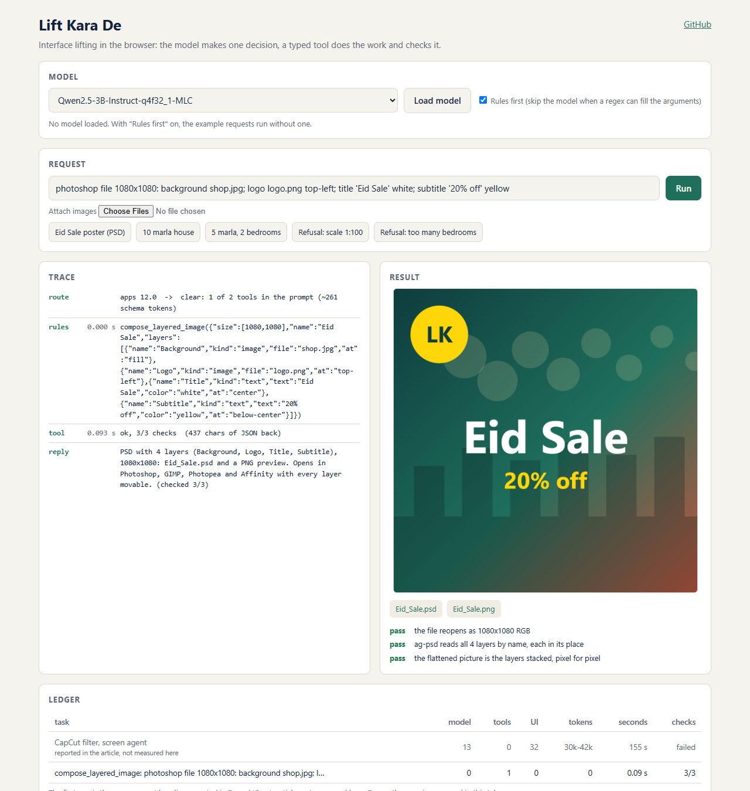
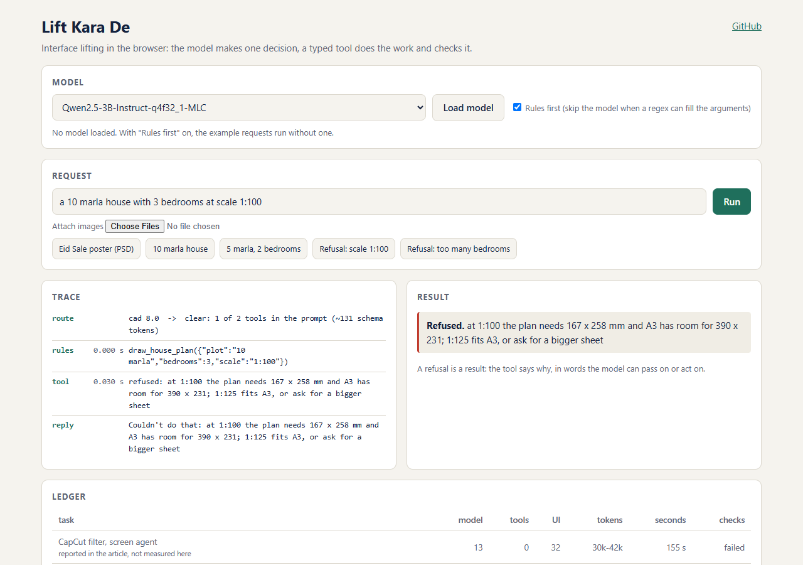
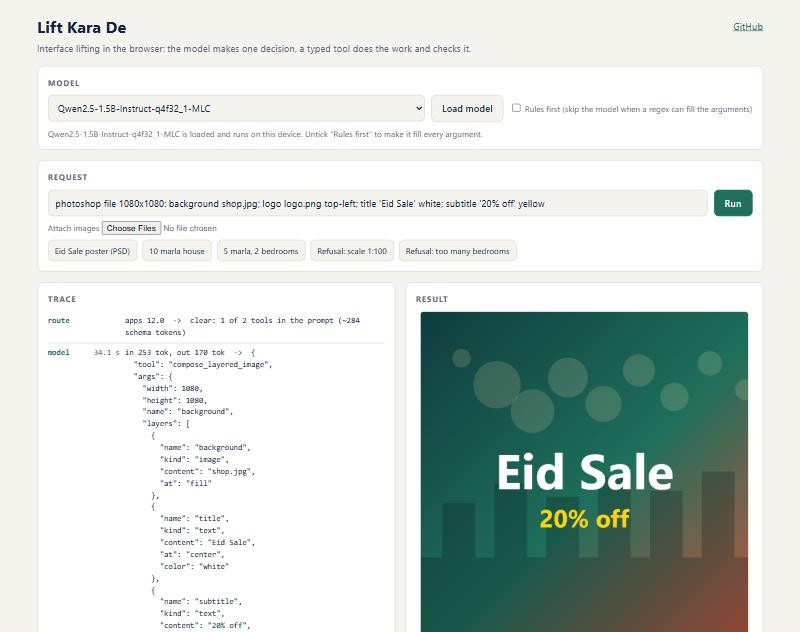

# Interface Lifting in a Browser Tab

*A small WebLLM study of the idea behind Fareed Khan's fast computer agent.*

> **Credit.** This project is inspired by Fareed Khan's article
> [Building Fast Computer Agents to Solve Complex Tasks](https://medium.com/@fareedkhandev/cf2bda5c54e7)
> and his open-source [ai-pc](https://github.com/FareedKhan-dev/ai-pc) repository. The idea, the tool contract, the
> ledger, the Eid Sale poster and the 10 marla house are his. What is new here is the setting: no server, no API key,
> no installed program. Everything, the model included, runs in one browser tab.

Live demo: https://vishalmysore.github.io/liftKaraDe/ · Code: https://github.com/vishalmysore/liftKaraDe

## The idea in one paragraph

A screen agent looks at a screenshot, asks a model where to click, clicks, waits, and repeats. Every click costs a
model call. Fareed Khan's article argues that the slow part is the interface, not the model, and proposes
*interface lifting*: give the model each program feature as a typed tool that drives the program through its own
file format, command line or API. The model makes one decision for a whole unit of work. The tool does the work,
checks its own output, and sends back a short piece of JSON instead of a picture.

## Why this matters even more in a browser

A hosted model answers a tool call in a second or two. A model running on a laptop's integrated GPU through WebGPU
is far slower, and its context window is a few thousand tokens. On the machine used for this write-up, a 1.5B model
took 6 to 9 seconds for a call with about 180 input tokens and 36 output tokens. A screen loop of 13 model calls is
not slow on that hardware, it is unusable. One call per task is the only budget that works.

So the three things the article treats as optimisations become requirements:

1. **A shortlist**, because the tool schemas have to fit in the context at all.
2. **One decision per task**, because every call costs seconds.
3. **Text results**, because there is no room for pictures in the prompt.

## What the ai-pc code actually does

Reading the repository next to the article was useful. The article explains the design with a `@tool` decorator and
model function calling. The repository is built *rules first*: `assistant/router.py` scores each program family with
regex signals, and a model is asked only when the rules cannot decide. That is the design that suits a small local
model, so this demo follows the repository:

- Regex signals pick the tool group. A group is a clear winner at a score of 5 or more with a lead of 1.5 or more.
- A per-tool rules lane tries to fill the arguments with no model at all.
- When the rules cannot, the model fills them, and its reply is constrained to the tool's JSON schema while it decodes,
  so it always parses.
- The reply to the user is templated from the checked result. There is no second model call to rephrase it.

## The tool contract

Each tool has the four parts from the article, plus the optional rules lane:

```ts
tool({
  name: "draw_house_plan",
  group: "cad",                       // the shortlist puts whole groups in the prompt
  effect: "local",                    // "outward" tools would wait for a yes
  description: "Draw a ground floor plan as a DXF for AutoCAD ...",   // all the model ever learns
  parameters: { type: "object", properties: { plot: { type: "string" }, bedrooms: { type: "integer" } } },
  fn: drawHousePlan,                  // does the work and returns its own checks
  rules,                              // fills the arguments from a regex, or returns null
});
```

And each tool returns the same shape: `ok`, a summary, files, and the list of checks it ran.

## Tool 1: a layered PSD, written byte by byte

There is no Photoshop in a browser, but the PSD format is documented. `src/apps/psd.ts` is a port of the article's
`write_psd`: a header, one record per layer, each layer's raw channels, then the flattened picture. The verifier
reopens the bytes with [ag-psd](https://github.com/Agamnentzar/ag-psd), a reader that knows nothing about the writer,
compares every layer's name and box, restacks the decoded layers and compares the result with the stored flattened
picture pixel for pixel.



The file downloads and is a real PSD with four named, movable layers.

## Tool 2: a house plan as a DXF

"A 10 marla house with 3 bedrooms" is a 35 by 65 foot plot. The tool searches 6,000 candidate layouts: rooms in bands
from the road back, each candidate scored for room areas, corridor-shaped rooms, daylight and doors, with 40 penalty
points for any room nobody can walk to. It writes the best one as a DXF in inches and as an SVG preview.


The 18 checks are of four kinds: one on the brief, six rules about the plan (every room reachable, no overlaps, each
bedroom has a bath), nine read-backs of the saved DXF through
[dxf-parser](https://github.com/gdsestimating/dxf-parser), and two on the sheet. The whole tool call took about 40
milliseconds.

## Refusals are results

Ask for the same house at 1:100 and the tool does not draw something wrong. It refuses, and says what would work:



## What the small model got wrong, and what caught it

These are the interesting results, and the reason the verifier is the most important part of the contract.

**It copied an example out of the tool's manual.** The first version of the description said
`plot: '10 marla', '1 kanal' or '35 x 65 ft'`. Asked for "a 5 marla plot with 2 bedrooms", Qwen2.5-1.5B wrote
`"plot": "10 marla"`. Every geometry check passed, because a 10 marla plan is a perfectly valid plan. The fix had two
parts: the description now says `'<n> marla'` with no copyable example, and the tool gained a check that the plot it
was given actually appears in the request. With that change the same model wrote `"5 marla"`.

**It dropped a layer.** Asked for the four-layer poster, the same model wrote three layers and left the logo out:



The PSD it produced was valid, so the three file checks passed. The "asked versus delivered" check failed, and the
result came back as 4 of 5 with the reason: every file the request names should be a layer, and `logo.png` was not.
An earlier, more nested schema did worse (an empty size and no image layers at all), which is why the arguments are
now flat: `width`, `height`, and one `content` field per layer.

## The ledger

Measured in this tab on an integrated GPU, with the article's screen-agent baseline quoted for scale:

| task | model calls | tool calls | input tokens | seconds | checks |
|---|---|---|---|---|---|
| CapCut filter, screen agent (reported in the article, not measured here) | 13 | 0 | 30k-42k | 155 s | failed |
| house plan, rules lane | 0 | 1 | 0 | 0.04 s | 18/18 |
| poster, rules lane | 0 | 1 | 0 | 0.1 to 1.1 s | 3/3 |
| house plan, Qwen2.5-1.5B fills the arguments | 1 | 1 | 177 | 7.7 s | 18/18 |
| poster, Qwen2.5-1.5B fills the arguments | 1 | 1 | 253 | 35.8 s | 4/5 |

The comparison with the first row is loose: it is a different task on a different model. What the table does show is
the shape of the cost. The tool work is milliseconds. All the time is the model, so the design that wins is the one
that asks the model least. The very first model call after loading was much slower (about 49 seconds) while shaders
and the grammar compiled.

## Limits

- The outputs are checked by independent parsers, not by Photoshop or AutoCAD themselves. The PSD and DXF are
  standard files, but they were not opened in those programs for this write-up.
- The plan search is a simple band layout. On plots under 50 feet wide the kitchen and lounge never get an outside
  wall, and the tool says so in its notes.
- A 1.5B model is at the edge of what works for nested arguments. Larger models in the picker (Qwen2.5-3B,
  Hermes-3-Llama-3.2-3B) were not measured here.
- Two tools only. The article's chains across programs, approval gate, accessibility-tree agent and skill compiler
  are the next steps; in a browser the accessibility tree becomes the DOM.

## Run it

Open the [live demo](https://vishalmysore.github.io/liftKaraDe/). The examples run immediately in the rules lane.
To watch a model fill the arguments, load one (WebGPU needed, the weights download once) and untick "Rules first".

Thanks to Fareed Khan for the article and for publishing the code behind it.
